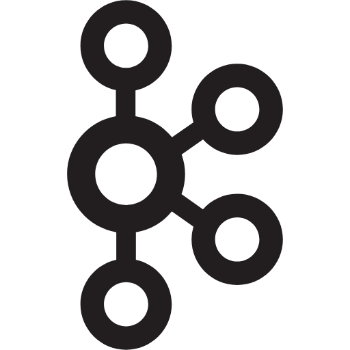
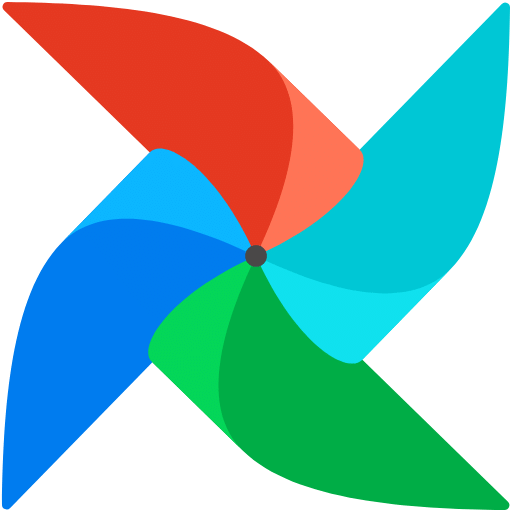
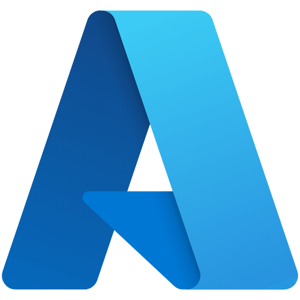

<h1 align="center">
    
</h1>

<h3 align="center">With a heart full of passion for data, I’m a Data Engineer from Vietnam, weaving magic from numbers to create impactful solutions!</h3>

 
  
  
  

 

## Fun facts 📝

🌱 I’m currently learning more about **Kafka, Airflow, Azure, Docker.**

❤️‍🔥 Highly enthusiastic about Data Engineering and DataOps,  
&nbsp;&nbsp;&nbsp;&nbsp;&nbsp;&nbsp;aspiring to reach a Senior level in this field within the next 5 years.

☕ 12 hours a day of learning—when caffeine and curiosity kick in together!

😬 Lowercase SQL keywords? Oops, my trust just got a `NULL` assignment.

😴 Dream big! Just remember, the bigger the dream, the bigger the nap you’ll need.

 
 
<h2 align="center">💻	Technologies 💻</h2>
 

    
    
    
    
    
    
    
    
 

 

  <h2>🐍 My Contributions 🐍</h2>
   
  
  
     

<h2 align="center">⚡ Stats ⚡</h2>
 

  

   

  
  
